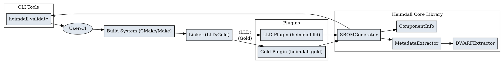
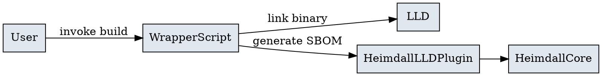
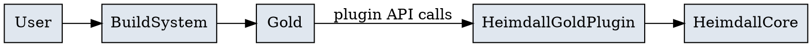

# Heimdall Developer's Guide

---

## 1. Product Overview

**Heimdall** is a cross-platform, extensible Software Bill of Materials (SBOM) generator for C/C++ binaries. It integrates with modern linkers (GNU Gold and LLVM LLD) to extract rich metadata—including version, license, symbol, section, and debug information—directly from build artifacts. Heimdall supports both SPDX and CycloneDX SBOM formats, and is designed for security, compliance, and supply chain transparency.

**Key Features:**
- Generates SBOMs in SPDX (2.3/3.0) and CycloneDX (1.4/1.5/1.6) formats
- Deep binary analysis: symbols, sections, dependencies, debug info (DWARF)
- Plugin-based: supports both GNU Gold and LLVM LLD linkers
- CLI tools for validation, comparison, and merging
- Extensible, modern C++ codebase

---

## 2. Architecture Overview

Heimdall is organized into several core components:
- **Core Library**: Metadata extraction, SBOM generation, and component modeling
- **Plugins**: LLD and Gold plugins for integration with linkers
- **CLI Tools**: Validation, comparison, and merging utilities
- **Build Scripts**: Integration with CMake, Make, and shell wrappers

### 2.1 High-Level Architecture Diagram



---

## 3. Plugin System

### 3.1 Plugin Interface
Heimdall defines a common `PluginInterface` for all linker plugins. This interface ensures that both LLD and Gold plugins can:
- Process input files and libraries
- Extract symbols, sections, and debug info
- Generate SBOMs in multiple formats
- Support configuration (output path, format, verbosity, etc.)

### 3.2 LLD Plugin

#### 3.2.1 Architecture
The LLD plugin (`heimdall-lld`) is designed to work with LLVM's LLD linker. It provides hooks for file and library processing, and integrates with the core SBOM generation logic.

#### 3.2.2 Why a Wrapper is Required
LLD does not natively support the same plugin API as GNU Gold. Instead, Heimdall uses a **wrapper script** approach:
- The build system invokes a wrapper script instead of LLD directly.
- The script runs LLD to link the binary.
- After linking, the script loads the Heimdall plugin and calls its SBOM generation functions.

**Rationale:**
- No need to patch or recompile LLD
- Works with any stock LLD installation
- Simple to maintain and deploy

**Limitations:**
- The plugin is not called during the linking process, so per-file or per-library callbacks are not available.
- The user must use the wrapper script instead of invoking LLD directly.

#### 3.2.3 LLD Plugin Integration Diagram


#### 3.2.4 Deeper Integration (Not Default)
A custom-patched LLD could call Heimdall hooks during linking, but this requires maintaining a forked LLD and is not recommended for most users.

### 3.3 Gold Plugin

#### 3.3.1 Architecture
The Gold plugin (`heimdall-gold`) integrates directly with GNU Gold's plugin API. Gold calls plugin hooks during the linking process, allowing Heimdall to:
- Process each input file and library as it is linked
- Extract metadata in real time
- Generate SBOMs automatically at the end of linking

#### 3.3.2 Gold Plugin Integration Diagram


---

## 4. API Reference

### 4.1 Core Classes

#### SBOMGenerator
- Responsible for collecting component information and generating SBOMs in various formats (SPDX, CycloneDX)
- Key methods:
  - `processComponent(const ComponentInfo&)`
  - `generateSBOM()`
  - `setOutputPath(const std::string&)`
  - `setFormat(const std::string&)`
  - `setCycloneDXVersion(const std::string&)`
  - `setSPDXVersion(const std::string&)`
  - `getComponentCount() const`
  - `hasComponent(const std::string&) const`
  - `printStatistics() const`

#### MetadataExtractor
- Extracts metadata from binary files (symbols, sections, dependencies, debug info, package manager info)
- Key methods:
  - `extractMetadata(ComponentInfo&)`
  - `extractVersionInfo(ComponentInfo&)`
  - `extractLicenseInfo(ComponentInfo&)`
  - `extractSymbolInfo(ComponentInfo&)`
  - `extractSectionInfo(ComponentInfo&)`
  - `extractDebugInfo(ComponentInfo&)`
  - `extractDependencyInfo(ComponentInfo&)`
  - `setVerbose(bool)`
  - `setExtractDebugInfo(bool)`

#### ComponentInfo
- Represents a software component (binary, library, etc.)
- Fields:
  - `name`, `filePath`, `version`, `supplier`, `downloadLocation`, `homepage`, `license`, `checksum`, `packageManager`, `fileType`, `fileSize`, `symbols`, `sections`, `dependencies`, `sourceFiles`, `functions`, `compileUnits`, `wasProcessed`, `processingError`, `detectedBy`, `isSystemLibrary`, `containsDebugInfo`, `isStripped`
- Key methods:
  - `addSymbol(const SymbolInfo&)`
  - `addSection(const SectionInfo&)`
  - `addDependency(const std::string&)`
  - `addSourceFile(const std::string&)`
  - `setVersion(const std::string&)`
  - `setSupplier(const std::string&)`
  - `setDownloadLocation(const std::string&)`
  - `setHomepage(const std::string&)`
  - `setLicense(const std::string&)`
  - `setPackageManager(const std::string&)`
  - `markAsProcessed()`
  - `setProcessingError(const std::string&)`

#### DWARFExtractor
- Extracts DWARF debug information for source file, function, and compile unit tracking
- Key methods:
  - `extractSourceFiles(const std::string&, std::vector<std::string>&)`
  - `extractCompileUnits(const std::string&, std::vector<std::string>&)`
  - `extractFunctions(const std::string&, std::vector<std::string>&)`
  - `extractLineInfo(const std::string&, std::vector<std::string>&)`
  - `hasDWARFInfo(const std::string&)`

### 4.2 Plugin Interfaces

#### PluginInterface
- Abstract base for all plugins
- Key methods:
  - `initialize()`, `cleanup()`, `processInputFile()`, `processLibrary()`, `processSymbol()`, `setOutputPath()`, `setFormat()`, `setCycloneDXVersion()`, `setSPDXVersion()`, `generateSBOM()`, `setVerbose()`, `setExtractDebugInfo()`, `setIncludeSystemLibraries()`, `getComponentCount() const`, `printStatistics() const`

#### LLDAdapter / GoldAdapter
- Concrete implementations for LLD and Gold
- Methods mirror the PluginInterface, with additional internal logic for each linker

---

## 5. Build, Test, and Extend

### 5.1 Building Heimdall
- Use CMake for cross-platform builds
- Example:
  ```bash
  cmake -S . -B build
  cmake --build build --parallel
  ```
- See `docs/heimdall-users-guide.md` for platform-specific instructions

### 5.2 Running Tests
- Run all tests:
  ```bash
  ctest --test-dir build --output-on-failure
  ```
- See `docs/testing-heimdall.md` for more details

### 5.3 Extending Heimdall
- Add new plugins by implementing the `PluginInterface`
- Extend metadata extraction by enhancing `MetadataExtractor` and related helpers
- Add new SBOM formats by extending `SBOMGenerator`

---

## 6. Advanced Topics

### 6.1 DWARF Extraction and Fallback
- Heimdall uses LLVM's DWARF libraries for robust debug info extraction
- If LLVM extraction fails, a heuristic fallback scans `.debug_line` for source files
- See `docs/dwarf-heuristic-rationale.md` for details

### 6.2 Thread-Safety and Limitations
- LLVM's DWARF libraries are **not thread-safe**; use only one `DWARFExtractor` at a time
- See `docs/heimdall-limitations.md` for more

### 6.3 Best Practices
- Always compile with debug info (`-g`) for best SBOMs
- Use the wrapper script for LLD integration
- Validate SBOMs after generation
- Review and update build scripts for new plugin versions

---

For further details, see the [Heimdall User's Guide](./heimdall-users-guide.md), [SBOM Validation Guide](./sbom_validation_guide.md), and [Testing Guide](./testing-heimdall.md). 
---
**Note:** To generate HTML and PDF versions of this guide, install [pandoc](https://pandoc.org/) and [pdflatex](https://www.tug.org/texlive/) (from TeX Live):

```sh
sudo dnf install -y pandoc texlive
```

Then use the CMake targets `docs-html` and `docs-pdf`.
