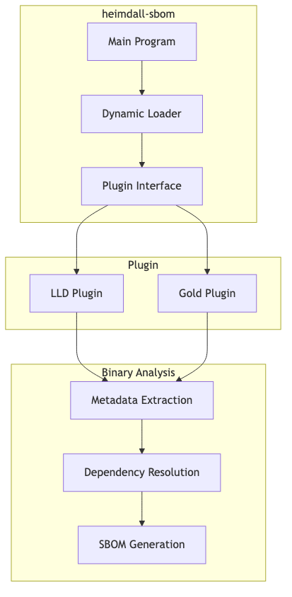

# Heimdall SBOM - Dynamic SBOM Generator Loader

## Table of Contents

1. [Overview](#overview)
2. [Installation](#installation)
3. [Quick Start](#quick-start)
4. [Commands Reference](#commands-reference)
5. [Supported Formats](#supported-formats)
6. [Plugin System](#plugin-system)
7. [Examples](#examples)
8. [Advanced Usage](#advanced-usage)
   - [SBOM Signing](#sbom-signing)
9. [Troubleshooting](#troubleshooting)
10. [Integration](#integration)

## Overview

`heimdall-sbom` is a dynamic SBOM generator loader that provides a lightweight command-line interface for generating Software Bills of Materials from binary files using Heimdall plugins. It dynamically loads linker plugins and generates SBOMs in multiple formats without requiring the full Heimdall library to be linked.

### Key Features

- **Dynamic Plugin Loading**: Loads Heimdall plugins at runtime using `dlopen`/`dlsym`
- **Multi-format Support**: SPDX (2.3, 3.0, 3.0.0, 3.0.1) and CycloneDX (1.4, 1.5, 1.6)
- **Lightweight**: Minimal dependencies, only requires the plugin shared library
- **Flexible Configuration**: Configurable output formats, versions, and dependency handling
- **Cross-platform**: Works on Linux and macOS with ELF and Mach-O binaries
- **Batch Processing**: Process multiple binaries with different configurations

### Use Cases

- **Standalone SBOM Generation**: Generate SBOMs without full Heimdall installation
- **CI/CD Integration**: Lightweight SBOM generation in build pipelines
- **Plugin Testing**: Test Heimdall plugins independently
- **Binary Analysis**: Analyze existing binaries for SBOM generation
- **Format Conversion**: Convert between different SBOM formats

## Installation

### Prerequisites

- C++17 or later compiler
- CMake 3.15 or later
- Git
- Dynamic linking support (`dlopen`/`dlsym`)

### Building from Source

```bash
# Clone the repository
git clone https://github.com/Heimdall-SBOM/heimdall.git
cd heimdall

# Build the project
mkdir build && cd build
cmake ..
make -j$(nproc)

# The heimdall-sbom tool will be available at:
# build/heimdall-sbom
```

### Verifying Installation

```bash
./build/heimdall-sbom --help
# or
./build/heimdall-sbom
```

## Quick Start

### Basic SBOM Generation

```bash
# Generate CycloneDX SBOM from a binary
heimdall-sbom /path/to/heimdall-lld.so myapp --format cyclonedx --output myapp.cdx.json

# Generate SPDX SBOM from a binary
heimdall-sbom /path/to/heimdall-lld.so myapp --format spdx --output myapp.spdx

# Use default format (SPDX 2.3)
heimdall-sbom /path/to/heimdall-lld.so myapp --output myapp.sbom
```

### Using Different Plugin Types

```bash
# Use LLD plugin
heimdall-sbom /usr/lib/heimdall/heimdall-lld.so myapp --format cyclonedx-1.6

# Use Gold plugin
heimdall-sbom /usr/lib/heimdall/heimdall-gold.so myapp --format spdx-3.0
```

## Commands Reference

### Basic Syntax

```bash
heimdall-sbom <plugin_path> <binary_path> [options]
```

### Required Arguments

- `<plugin_path>` - Path to the Heimdall plugin shared library
- `<binary_path>` - Path to the binary file to analyze

### Options

#### Format Options

- `--format <format>` - Specify SBOM format
  - **SPDX formats**: `spdx`, `spdx-2.3`, `spdx-3.0`, `spdx-3.0.0`, `spdx-3.0.1`
  - **CycloneDX formats**: `cyclonedx`, `cyclonedx-1.4`, `cyclonedx-1.5`, `cyclonedx-1.6`
  - **Default**: `spdx-2.3`

#### Output Options

- `--output <path>` - Output file path (default: `sbom.json`)
- `--cyclonedx-version <version>` - CycloneDX specification version (default: `1.6`)
- `--spdx-version <version>` - SPDX specification version (default: `2.3`)

#### Dependency Options

- `--no-transitive-dependencies` - Include only direct dependencies (default: include all transitive dependencies)

#### Ada Detection Options

- `--ali-file-path <path>` - Specify directory to search for Ada Library Information (.ali) files
  - Enables Ada detection and restricts search to the specified path only
  - Useful for large projects where scanning all directories would be slow
  - Example: `--ali-file-path /path/to/ada/project`

#### Signing Options

- `--sign-key <path>` - Path to private key file for SBOM signing (PEM format)
- `--sign-cert <path>` - Path to certificate file (optional, PEM format)
- `--sign-algorithm <algorithm>` - Signature algorithm (RS256, RS384, RS512, ES256, ES384, ES512, Ed25519, default: RS256)
- `--sign-key-id <id>` - Key identifier for signature metadata

#### Examples

```bash
# Basic usage with defaults
heimdall-sbom /usr/lib/heimdall/heimdall-lld.so myapp

# Specify format and output
heimdall-sbom /usr/lib/heimdall/heimdall-lld.so myapp \
    --format cyclonedx-1.6 \
    --output myapp.cdx.json

# SPDX with specific version
heimdall-sbom /usr/lib/heimdall/heimdall-lld.so myapp \
    --format spdx-3.0 \
    --output myapp.spdx

# Only direct dependencies
heimdall-sbom /usr/lib/heimdall/heimdall-lld.so myapp \
    --format cyclonedx \
    --no-transitive-dependencies \
    --output myapp-direct.cdx.json

# With Ada detection enabled for specific path
heimdall-sbom /usr/lib/heimdall/heimdall-lld.so myapp \
    --format cyclonedx-1.6 \
    --ali-file-path /path/to/ada/project \
    --output myapp-with-ada.cdx.json
```

## Supported Formats

### CycloneDX Support

| Version | Status | Features |
|---------|--------|----------|
| 1.4 | ✅ Full Support | Basic component structure, metadata |
| 1.5 | ✅ Full Support | Enhanced validation, additional fields |
| 1.6 | ✅ Full Support | Latest features, complete validation |

**Generated Fields:**
- `bomFormat`, `specVersion`, `version`, `metadata`
- Component information (name, version, type, purl)
- Dependencies and relationships
- File hashes and integrity information
- License information
- Supplier and author details

### SPDX Support

| Version | Status | Format | Features |
|---------|--------|--------|----------|
| 2.3 | ✅ Full Support | Tag-value | Complete validation |
| 3.0 | ✅ Full Support | JSON | Complete validation |
| 3.0.0 | ✅ Full Support | JSON | Complete validation |
| 3.0.1 | ✅ Full Support | JSON | Complete validation |

**Generated Fields:**
- `SPDXVersion`, `DataLicense`, `DocumentName`
- Package and file information
- License expressions and identifiers
- Checksums and integrity information
- Relationships between components
- Creator and creation information

## Plugin System

### Plugin Architecture

`heimdall-sbom` uses dynamic loading to interface with Heimdall plugins:



### Required Plugin Functions

The tool expects the following functions to be exported by the plugin:

```cpp
// Plugin initialization
int onload(void* context);

// Format configuration
int heimdall_set_format(const char* format);
int heimdall_set_cyclonedx_version(const char* version);
int heimdall_set_spdx_version(const char* version);

// Output configuration
int heimdall_set_output_path(const char* path);
int heimdall_set_transitive_dependencies(int enabled);

// Processing
int heimdall_process_input_file(const char* path);

// Cleanup
void heimdall_finalize();
```

### Plugin Loading Process

1. **Library Loading**: Uses `dlopen()` to load the plugin shared library
2. **Symbol Resolution**: Uses `dlsym()` to resolve required function symbols
3. **Initialization**: Calls `onload()` to initialize the plugin
4. **Configuration**: Sets format, version, and output parameters
5. **Processing**: Calls `process_input_file()` to analyze the binary
6. **Finalization**: Calls `finalize()` to generate the SBOM
7. **Cleanup**: Unloads the plugin library

## Examples

### Basic Examples

#### Generate CycloneDX 1.6 SBOM
```bash
heimdall-sbom /usr/lib/heimdall/heimdall-lld.so myapp \
    --format cyclonedx-1.6 \
    --output myapp.cdx.json
```

**Expected Output:**
```
Processing myapp with heimdall-lld.so...
SBOM generated successfully: myapp.cdx.json
```

#### Generate SPDX 3.0 JSON SBOM
```bash
heimdall-sbom /usr/lib/heimdall/heimdall-lld.so myapp \
    --format spdx-3.0 \
    --output myapp.spdx.json
```

#### Generate SPDX 2.3 Tag-Value SBOM
```bash
heimdall-sbom /usr/lib/heimdall/heimdall-lld.so myapp \
    --format spdx-2.3 \
    --output myapp.spdx
```

### Advanced Examples

#### Process Multiple Binaries
```bash
#!/bin/bash
# process-binaries.sh

PLUGIN="/usr/lib/heimdall/heimdall-lld.so"
FORMAT="cyclonedx-1.6"

for binary in *.exe *.bin; do
    if [ -f "$binary" ]; then
        echo "Processing $binary..."
        heimdall-sbom "$PLUGIN" "$binary" \
            --format "$FORMAT" \
            --output "${binary%.*}.cdx.json"
    fi
done
```

#### Batch Processing with Different Formats
```bash
#!/bin/bash
# batch-sbom.sh

PLUGIN="/usr/lib/heimdall/heimdall-lld.so"
BINARY="myapp"

# Generate multiple formats
heimdall-sbom "$PLUGIN" "$BINARY" --format cyclonedx-1.6 --output "$BINARY.cdx.json"
heimdall-sbom "$PLUGIN" "$BINARY" --format spdx-3.0 --output "$BINARY.spdx.json"
heimdall-sbom "$PLUGIN" "$BINARY" --format spdx-2.3 --output "$BINARY.spdx"

echo "Generated SBOMs:"
ls -la "$BINARY".*
```

#### Compare Direct vs Transitive Dependencies
```bash
# Generate SBOM with all dependencies
heimdall-sbom /usr/lib/heimdall/heimdall-lld.so myapp \
    --format cyclonedx-1.6 \
    --output myapp-all.cdx.json

# Generate SBOM with only direct dependencies
heimdall-sbom /usr/lib/heimdall/heimdall-lld.so myapp \
    --format cyclonedx-1.6 \
    --no-transitive-dependencies \
    --output myapp-direct.cdx.json

# Compare the results
diff myapp-all.cdx.json myapp-direct.cdx.json
```

#### Signing SBOMs
```bash
# Generate and sign a CycloneDX SBOM
heimdall-sbom /usr/lib/heimdall/heimdall-lld.so myapp \
    --format cyclonedx-1.6 \
    --output myapp-signed.cdx.json \
    --sign-key private.key \
    --sign-algorithm RS256

# Sign with certificate and key ID
heimdall-sbom /usr/lib/heimdall/heimdall-lld.so myapp \
    --format cyclonedx-1.6 \
    --output myapp-signed.cdx.json \
    --sign-key private.key \
    --sign-cert certificate.pem \
    --sign-algorithm ES256 \
    --sign-key-id "my-key-2025"
```

## Advanced Usage

### SBOM Signing

Heimdall supports signing SBOMs using the JSON Signature Format (JSF) for CycloneDX 1.6+ documents. This provides cryptographic integrity and authenticity verification for generated SBOMs.

#### Supported Signing Algorithms

The following cryptographic algorithms are supported:

**RSA Signatures:**
- **RS256** - RSA with SHA-256 (default)
- **RS384** - RSA with SHA-384  
- **RS512** - RSA with SHA-512

**ECDSA Signatures:**
- **ES256** - ECDSA with SHA-256
- **ES384** - ECDSA with SHA-384
- **ES512** - ECDSA with SHA-512

**Ed25519 Signatures:**
- **Ed25519** - Ed25519 signature (no separate digest)

#### Basic Signing

```bash
# Sign a CycloneDX SBOM with RSA
heimdall-sbom /usr/lib/heimdall/heimdall-lld.so myapp \
    --format cyclonedx-1.6 \
    --output myapp.cdx.json \
    --sign-key private.key \
    --sign-algorithm RS256

# Sign with ECDSA
heimdall-sbom /usr/lib/heimdall/heimdall-lld.so myapp \
    --format cyclonedx-1.6 \
    --output myapp.cdx.json \
    --sign-key ecdsa_private.key \
    --sign-algorithm ES256

# Sign with Ed25519
heimdall-sbom /usr/lib/heimdall/heimdall-lld.so myapp \
    --format cyclonedx-1.6 \
    --output myapp.cdx.json \
    --sign-key ed25519_private.key \
    --sign-algorithm Ed25519
```

#### Signing Options

- `--sign-key <path>` - Path to private key file (PEM format)
- `--sign-cert <path>` - Path to certificate file (optional, PEM format)
- `--sign-algorithm <algorithm>` - Signature algorithm (default: RS256)
- `--sign-key-id <id>` - Key identifier for signature metadata

#### Key Management

**Generating RSA Keys:**
```bash
# Generate RSA private key
openssl genrsa -out private.key 2048

# Generate RSA public key
openssl rsa -in private.key -pubout -out public.key

# Generate self-signed certificate
openssl req -new -x509 -key private.key -out certificate.pem -days 365
```

**Generating ECDSA Keys:**
```bash
# Generate ECDSA private key (P-256 curve)
openssl ecparam -genkey -name prime256v1 -out ecdsa_private.key

# Generate ECDSA public key
openssl ec -in ecdsa_private.key -pubout -out ecdsa_public.key
```

**Generating Ed25519 Keys:**
```bash
# Generate Ed25519 private key
openssl genpkey -algorithm ED25519 -out ed25519_private.key

# Generate Ed25519 public key
openssl pkey -in ed25519_private.key -pubout -out ed25519_public.key
```

#### Signature Structure

The signature follows the JSON Signature Format (JSF) specification:

```json
{
  "signature": {
    "algorithm": "RS256",
    "value": "base64-encoded-signature",
    "keyId": "key-identifier",
    "excludes": ["signature", "components[0].signature"]
  }
}
```

**Signature Fields:**
- `algorithm` - The signature algorithm used (required)
- `value` - Base64-encoded signature value (required)
- `keyId` - Key identifier for verification (optional)
- `excludes` - Array of fields excluded during canonicalization (optional)

#### Canonicalization

Before signing, the SBOM content is canonicalized according to JSF standards:

1. **Field Exclusion**: All existing `signature` fields are removed from the SBOM
2. **JSON Canonicalization**: Content is serialized using RFC 8785 JSON Canonicalization Scheme
3. **Excludes Tracking**: Removed field paths are tracked in the `excludes` array

This ensures that:
- The signature covers only the actual SBOM content
- Existing signatures don't interfere with new signatures
- The canonicalization process is transparent and verifiable

#### Verification

Signed SBOMs can be verified using standard cryptographic tools:

```bash
# Extract the signature value
jq -r '.signature.value' myapp.cdx.json | base64 -d > signature.bin

# Extract the canonicalized content (excluding signature fields)
jq 'del(.signature)' myapp.cdx.json | jq -c . > content.json

# Verify with OpenSSL
openssl dgst -sha256 -verify public.key -signature signature.bin content.json
```

#### Advanced Signing Examples

**Signing with Certificate:**
```bash
heimdall-sbom /usr/lib/heimdall/heimdall-lld.so myapp \
    --format cyclonedx-1.6 \
    --output myapp.cdx.json \
    --sign-key private.key \
    --sign-cert certificate.pem \
    --sign-algorithm RS256 \
    --sign-key-id "my-key-2025"
```

**Batch Signing Multiple SBOMs:**
```bash
#!/bin/bash
# sign-sboms.sh

PLUGIN="/usr/lib/heimdall/heimdall-lld.so"
PRIVATE_KEY="private.key"
ALGORITHM="RS256"

for binary in *.exe *.bin; do
    if [ -f "$binary" ]; then
        echo "Signing SBOM for $binary..."
        heimdall-sbom "$PLUGIN" "$binary" \
            --format cyclonedx-1.6 \
            --output "${binary%.*}.cdx.json" \
            --sign-key "$PRIVATE_KEY" \
            --sign-algorithm "$ALGORITHM"
    fi
done
```

**Signing with Different Algorithms:**
```bash
# Generate multiple signed versions
heimdall-sbom /usr/lib/heimdall/heimdall-lld.so myapp \
    --format cyclonedx-1.6 \
    --output myapp-rs256.cdx.json \
    --sign-key rsa_private.key \
    --sign-algorithm RS256

heimdall-sbom /usr/lib/heimdall/heimdall-lld.so myapp \
    --format cyclonedx-1.6 \
    --output myapp-es256.cdx.json \
    --sign-key ecdsa_private.key \
    --sign-algorithm ES256

heimdall-sbom /usr/lib/heimdall/heimdall-lld.so myapp \
    --format cyclonedx-1.6 \
    --output myapp-ed25519.cdx.json \
    --sign-key ed25519_private.key \
    --sign-algorithm Ed25519
```

#### Integration with CI/CD

**GitHub Actions with SBOM Signing:**
```yaml
name: Build and Sign SBOM
on: [push, release]

jobs:
  build-and-sign:
    runs-on: ubuntu-latest
    steps:
      - uses: actions/checkout@v3
      
      - name: Build Application
        run: g++ -o myapp main.cpp
      
      - name: Setup OpenSSL
        run: |
          openssl genrsa -out private.key 2048
          openssl rsa -in private.key -pubout -out public.key
      
      - name: Generate and Sign SBOM
        run: |
          ./heimdall/build/heimdall-sbom \
            ./heimdall/build/lib/heimdall-lld.so \
            myapp \
            --format cyclonedx-1.6 \
            --output myapp.cdx.json \
            --sign-key private.key \
            --sign-algorithm RS256
      
      - name: Upload Signed SBOM
        uses: actions/upload-artifact@v3
        with:
          name: signed-sbom
          path: |
            myapp.cdx.json
            public.key
```

**Jenkins Pipeline with Signing:**
```groovy
pipeline {
    agent any
    
    environment {
        PRIVATE_KEY = credentials('sbom-signing-key')
    }
    
    stages {
        stage('Build') {
            steps {
                sh 'g++ -o myapp main.cpp'
            }
        }
        
        stage('Generate and Sign SBOM') {
            steps {
                sh '''
                    ./heimdall/build/heimdall-sbom \
                        ./heimdall/build/lib/heimdall-lld.so \
                        myapp \
                        --format cyclonedx-1.6 \
                        --output myapp.cdx.json \
                        --sign-key $PRIVATE_KEY \
                        --sign-algorithm RS256
                '''
            }
        }
        
        stage('Archive') {
            steps {
                archiveArtifacts artifacts: 'myapp.cdx.json'
            }
        }
    }
}
```

#### Security Considerations

1. **Key Protection**: Store private keys securely and never commit them to version control
2. **Algorithm Selection**: Use appropriate algorithms for your security requirements
   - RS256/ES256: Good general-purpose security
   - RS384/ES384: Higher security for sensitive applications
   - RS512/ES512: Maximum security for critical systems
   - Ed25519: Modern, efficient alternative
3. **Certificate Validation**: Use valid certificates from trusted Certificate Authorities
4. **Key Rotation**: Implement key rotation policies for long-term projects
5. **Verification**: Always verify signatures before trusting SBOM content

#### Troubleshooting Signing Issues

**Common Signing Errors:**

1. **"Failed to load private key"**
   ```bash
   # Check key file exists and is readable
   ls -la private.key
   chmod 600 private.key
   ```

2. **"Unsupported signature algorithm"**
   ```bash
   # Verify algorithm is supported
   heimdall-sbom --help | grep sign-algorithm
   ```

3. **"Failed to create signature"**
   ```bash
   # Check key format and OpenSSL compatibility
   openssl rsa -in private.key -check
   ```

4. **"Invalid key type for algorithm"**
   ```bash
   # Ensure key type matches algorithm
   # RSA key for RS256/RS384/RS512
   # EC key for ES256/ES384/ES512
   # Ed25519 key for Ed25519
   ```

### Plugin Development

#### Creating a Custom Plugin

```cpp
// my_plugin.cpp
#include <iostream>

extern "C" {
    int onload(void* context) {
        std::cout << "My plugin loaded successfully" << std::endl;
        return 0;
    }
    
    int heimdall_set_format(const char* format) {
        std::cout << "Setting format: " << format << std::endl;
        return 0;
    }
    
    int heimdall_set_output_path(const char* path) {
        std::cout << "Setting output path: " << path << std::endl;
        return 0;
    }
    
    int heimdall_process_input_file(const char* path) {
        std::cout << "Processing file: " << path << std::endl;
        // Your SBOM generation logic here
        return 0;
    }
    
    void heimdall_finalize() {
        std::cout << "Finalizing SBOM generation" << std::endl;
    }
}
```

#### Building the Plugin

```bash
# Compile the plugin
g++ -shared -fPIC my_plugin.cpp -o my_plugin.so

# Use with heimdall-sbom
heimdall-sbom ./my_plugin.so myapp --format cyclonedx --output myapp.cdx.json
```

### Integration with Build Systems

#### CMake Integration

```cmake
# CMakeLists.txt
find_package(Heimdall REQUIRED)

add_executable(myapp main.cpp)
target_link_libraries(myapp ${HEIMDALL_LIBRARIES})

# Custom target for SBOM generation
add_custom_target(sbom
    COMMAND heimdall-sbom
        ${HEIMDALL_PLUGIN_PATH}/heimdall-lld.so
        $<TARGET_FILE:myapp>
        --format cyclonedx-1.6
        --output ${CMAKE_BINARY_DIR}/myapp.cdx.json
    DEPENDS myapp
    COMMENT "Generating SBOM for myapp"
)
```

#### Makefile Integration

```makefile
# Makefile
HEIMDALL_PLUGIN = /usr/lib/heimdall/heimdall-lld.so
SBOM_FORMAT = cyclonedx-1.6

myapp: main.cpp
	g++ -o myapp main.cpp

sbom: myapp
	heimdall-sbom $(HEIMDALL_PLUGIN) myapp \
		--format $(SBOM_FORMAT) \
		--output myapp.cdx.json

.PHONY: sbom
```

### CI/CD Integration

#### GitHub Actions

```yaml
name: Generate SBOM
on: [push, pull_request]

jobs:
  sbom:
    runs-on: ubuntu-latest
    steps:
      - uses: actions/checkout@v3
      
      - name: Build Application
        run: |
          g++ -o myapp main.cpp
      
      - name: Install Heimdall
        run: |
          git clone https://github.com/Heimdall-SBOM/heimdall.git
          cd heimdall
          mkdir build && cd build
          cmake ..
          make -j$(nproc)
      
      - name: Generate SBOM
        run: |
          ./heimdall/build/heimdall-sbom \
            ./heimdall/build/lib/heimdall-lld.so \
            myapp \
            --format cyclonedx-1.6 \
            --output myapp.cdx.json
      
      - name: Upload SBOM
        uses: actions/upload-artifact@v3
        with:
          name: sbom
          path: myapp.cdx.json
```

#### Jenkins Pipeline

```groovy
pipeline {
    agent any
    
    stages {
        stage('Build') {
            steps {
                sh 'g++ -o myapp main.cpp'
            }
        }
        
        stage('Generate SBOM') {
            steps {
                sh '''
                    git clone https://github.com/Heimdall-SBOM/heimdall.git
                    cd heimdall
                    mkdir build && cd build
                    cmake ..
                    make -j$(nproc)
                    
                    ../../heimdall-sbom \
                        ./lib/heimdall-lld.so \
                        ../../myapp \
                        --format cyclonedx-1.6 \
                        --output ../../myapp.cdx.json
                '''
            }
        }
        
        stage('Archive SBOM') {
            steps {
                archiveArtifacts artifacts: 'myapp.cdx.json'
            }
        }
    }
}
```

## Troubleshooting

### Common Issues

#### 1. "Failed to load plugin"
**Cause:** Plugin file doesn't exist or has incorrect permissions
**Solution:** Check plugin path and permissions
```bash
ls -la /usr/lib/heimdall/heimdall-lld.so
chmod 755 /usr/lib/heimdall/heimdall-lld.so
```

#### 2. "Failed to get function symbols"
**Cause:** Plugin doesn't export required functions
**Solution:** Ensure plugin implements all required functions
```bash
nm -D /usr/lib/heimdall/heimdall-lld.so | grep heimdall
```

#### 3. "Failed to initialize plugin"
**Cause:** Plugin initialization failed
**Solution:** Check plugin logs and dependencies
```bash
# Check plugin dependencies
ldd /usr/lib/heimdall/heimdall-lld.so
```

#### 4. "Failed to process binary"
**Cause:** Binary file doesn't exist or is not supported
**Solution:** Verify binary path and format
```bash
file myapp
ls -la myapp
```

#### 5. "Failed to load private key"
**Cause:** Private key file doesn't exist, has wrong permissions, or is corrupted
**Solution:** Check key file and permissions
```bash
ls -la private.key
chmod 600 private.key
openssl rsa -in private.key -check
```

#### 6. "Unsupported signature algorithm"
**Cause:** Algorithm not supported or key type doesn't match algorithm
**Solution:** Use supported algorithm and matching key type
```bash
# Supported algorithms: RS256, RS384, RS512, ES256, ES384, ES512, Ed25519
# RSA key for RS256/RS384/RS512
# EC key for ES256/ES384/ES512  
# Ed25519 key for Ed25519
```

### Debug Mode

Enable verbose output for debugging:
```bash
# Set environment variable for verbose output
export HEIMDALL_VERBOSE=1
heimdall-sbom /usr/lib/heimdall/heimdall-lld.so myapp --format cyclonedx
```

### Error Codes

| Exit Code | Meaning |
|-----------|---------|
| 0 | Success |
| 1 | Plugin loading failed |
| 2 | Plugin initialization failed |
| 3 | Binary processing failed |
| 4 | Invalid command line arguments |
| 5 | Signing failed (key loading, algorithm, etc.) |

### Performance Tips

1. **Use absolute paths** for plugins and binaries to avoid path resolution issues
2. **Pre-load plugins** in long-running processes to avoid repeated loading overhead
3. **Use appropriate formats** for your use case (JSON for programmatic processing, tag-value for human reading)
4. **Consider dependency scope** - use `--no-transitive-dependencies` for faster processing when only direct dependencies are needed

## Integration

### With Other Tools

#### Integration with CycloneDX Tools
```bash
# Generate SBOM with heimdall-sbom
heimdall-sbom /usr/lib/heimdall/heimdall-lld.so myapp \
    --format cyclonedx-1.6 \
    --output myapp.cdx.json

# Validate with cyclonedx-cli
cyclonedx-cli validate myapp.cdx.json

# Convert to other formats
cyclonedx-cli convert --input-format json --output-format xml myapp.cdx.json
```

#### Integration with SPDX Tools
```bash
# Generate SPDX SBOM
heimdall-sbom /usr/lib/heimdall/heimdall-lld.so myapp \
    --format spdx-3.0 \
    --output myapp.spdx.json

# Validate with SPDX tools
spdx-tools-validate myapp.spdx.json
```

### API Integration

The tool can be integrated into custom scripts and applications:

```python
import subprocess
import json

def generate_sbom(plugin_path, binary_path, format='cyclonedx-1.6', output_path='sbom.json'):
    cmd = [
        'heimdall-sbom',
        plugin_path,
        binary_path,
        '--format', format,
        '--output', output_path
    ]
    
    result = subprocess.run(cmd, capture_output=True, text=True)
    return result.returncode == 0, result.stdout, result.stderr

# Usage
success, output, errors = generate_sbom(
    '/usr/lib/heimdall/heimdall-lld.so',
    'myapp',
    'cyclonedx-1.6',
    'myapp.cdx.json'
)

if success:
    print("SBOM generated successfully")
else:
    print(f"Error: {errors}")
```

### Configuration Files

Create configuration files for repeated operations:

```json
{
  "defaults": {
    "plugin_path": "/usr/lib/heimdall/heimdall-lld.so",
    "format": "cyclonedx-1.6",
    "include_transitive": true
  },
  "formats": {
    "cyclonedx": {
      "versions": ["1.4", "1.5", "1.6"],
      "default": "1.6"
    },
    "spdx": {
      "versions": ["2.3", "3.0", "3.0.0", "3.0.1"],
      "default": "2.3"
    }
  },
  "output": {
    "directory": "./sboms",
    "naming": "{binary}.{format}.{version}.json"
  }
}
```

### Shell Scripts

#### Automated SBOM Generation Script
```bash
#!/bin/bash
# generate-sboms.sh

PLUGIN_PATH="${HEIMDALL_PLUGIN:-/usr/lib/heimdall/heimdall-lld.so}"
OUTPUT_DIR="${SBOM_OUTPUT_DIR:-./sboms}"
FORMATS=("cyclonedx-1.6" "spdx-3.0" "spdx-2.3")

if [ $# -eq 0 ]; then
    echo "Usage: $0 <binary1> [binary2] ..."
    exit 1
fi

mkdir -p "$OUTPUT_DIR"

for binary in "$@"; do
    if [ ! -f "$binary" ]; then
        echo "Warning: $binary not found, skipping"
        continue
    fi
    
    echo "Processing $binary..."
    
    for format in "${FORMATS[@]}"; do
        output_file="$OUTPUT_DIR/$(basename "$binary").${format//-/.}.json"
        
        echo "  Generating $format SBOM..."
        if heimdall-sbom "$PLUGIN_PATH" "$binary" \
            --format "$format" \
            --output "$output_file"; then
            echo "    ✅ Generated: $output_file"
        else
            echo "    ❌ Failed to generate: $output_file"
        fi
    done
done

echo "SBOM generation complete. Files saved to: $OUTPUT_DIR"
```

## Conclusion

`heimdall-sbom` provides a lightweight, flexible interface for generating SBOMs from binary files using Heimdall plugins. Its dynamic loading approach makes it ideal for integration into existing toolchains and CI/CD pipelines without requiring full Heimdall installation.

For more information, see:
- [Heimdall User Guide](heimdall-users-guide.md)
- [Heimdall Validate Manual](heimdall-validate-manual.md)
- [Plugin Development Guide](heimdall-developers-guide.md)
- [CycloneDX Specification](https://cyclonedx.org/specification/)
